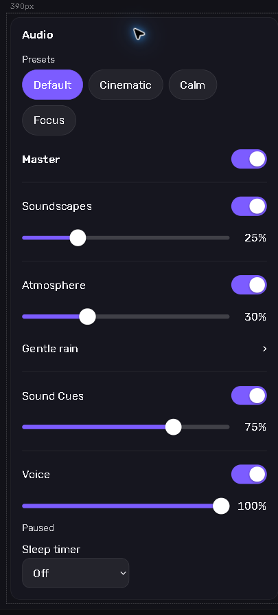
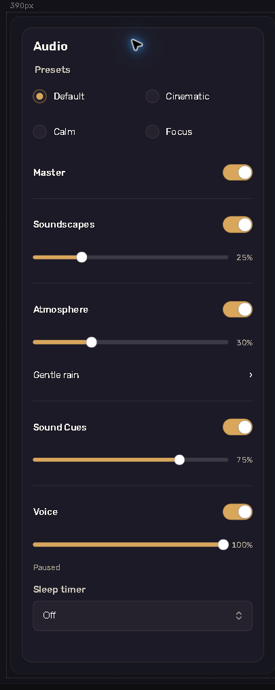
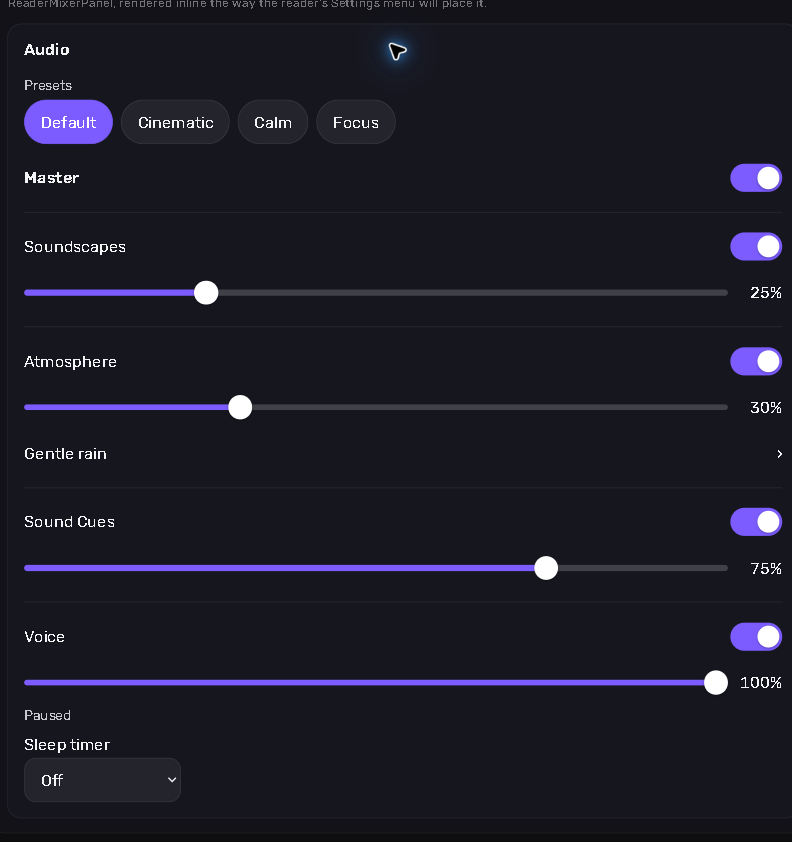
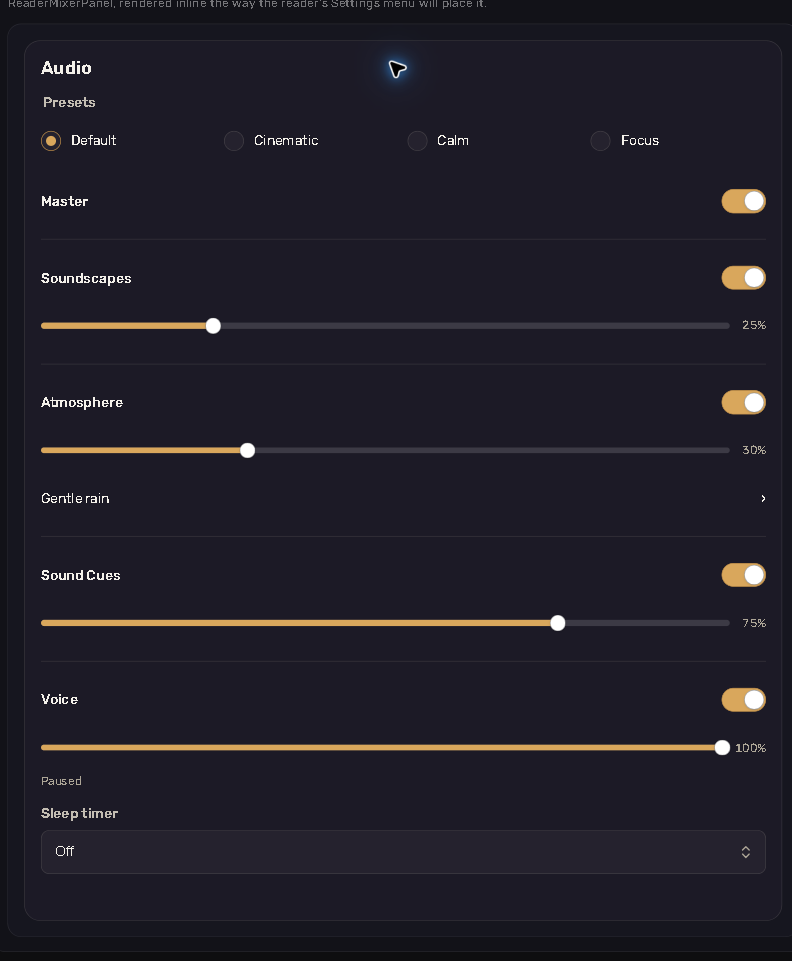

# Reader UI 4.0.0 visual verification

The new panel uses universal `@seihouse/ui` 0.10.1 from UI PR #87, source commit
`d3c630181b5fb35cbb9be50847c96fff2dbd5e4a`. The SEN experience's gold controls
come from its tokens; the player supplies no control colors. The tarball is
identical to development's vendored artifact, with its SHA-512 recorded in
[`vendor/ui-artifacts.json`](../../../vendor/ui-artifacts.json).

The before images are PR #182's merged implementation (branch deployment at
`10d939eeabde07cf53ee1493fb43cad51cd092b9`, included in merge
`3e28013d10d0e3f0e210dfa92f7cb0b5e592dfc5`). The after images show this branch's
local Workshop. Both use Default preferences, Voice connected, no chapter playing
and the atmosphere picker collapsed. These are native browser captures of the
settings frame, with a small surrounding margin.

| Settings width | Before | After |
| --- | --- | --- |
| 390 CSS px frame |  |  |
| Desktop Auto, about 776 CSS px |  |  |

## Environment and checks

Checked 2026-10-04 in desktop Chrome **154.0.8037.93**, Windows 11 Home
**10.0.22631** (build 22631). Screenshots use a 1280 × 900 CSS px viewport.
Phone layout was also checked in a 390 × 844 CSS px viewport, which had no
horizontal page overflow; switches, radio rows, slider thumbs/tracks, picker,
select and cancel controls have at least 44 CSS px targets.

- The same preset, switch, slider, radio, timer and status roles/names remain.
  Enter and Space both toggle the switches; Enter has a small compatibility
  handler because native checkbox switches otherwise handle only Space.
  A keyboard Right arrow moved Soundscapes from 25 to 26 and announced `26%`.
  Atmosphere arrow navigation selected Off; the compact picker retains grouped
  choices and a host-readable accessible name.
- Choosing 15 minutes showed “Stops in 15 min”; Cancel returned to Off.
  End of chapter fired after the host signal and changed the note's action to
  “Resume story audio”; tapping it resumed without changing preferences.
- Hiding Sound Cues removed only its row. The panel tests retain a row through
  dragging and focus, including focus that remains after a native slider drag.
- Master mute dims only the soundtrack's three rows. Voice retains full visual
  opacity and its own switch; the note reflects the same master state.
- Workshop offers both the 390 px frame and a Desktop 640 px frame, as well as
  Auto. Presets use two columns in narrow panels and four in wide panels through
  a container query, independent of the surrounding browser width.
- Existing panel tests cover the device-volume hint, empty state, labels,
  presets, availability, timer re-arming and polite row statuses. Existing note
  tests cover reduced-motion state; panel CSS removes animations/transitions
  under the same media preference, including the approved controls.
- Installed-package tests load the core's ESM/CommonJS entries and declarations
  with React 18 and no added UI peers. A separate React 19 consumer loads the
  panel under the root provider, compiles its explicit mixer prop against the
  packed declarations, and resolves its stylesheet.

Physical iPhone testing was waived for the PR #182 merge by the owner. These
checks establish the new controls and package boundary; they do not represent
physical iPhone listening evidence. The mixer engines and their policies are
unchanged in this UI task.
